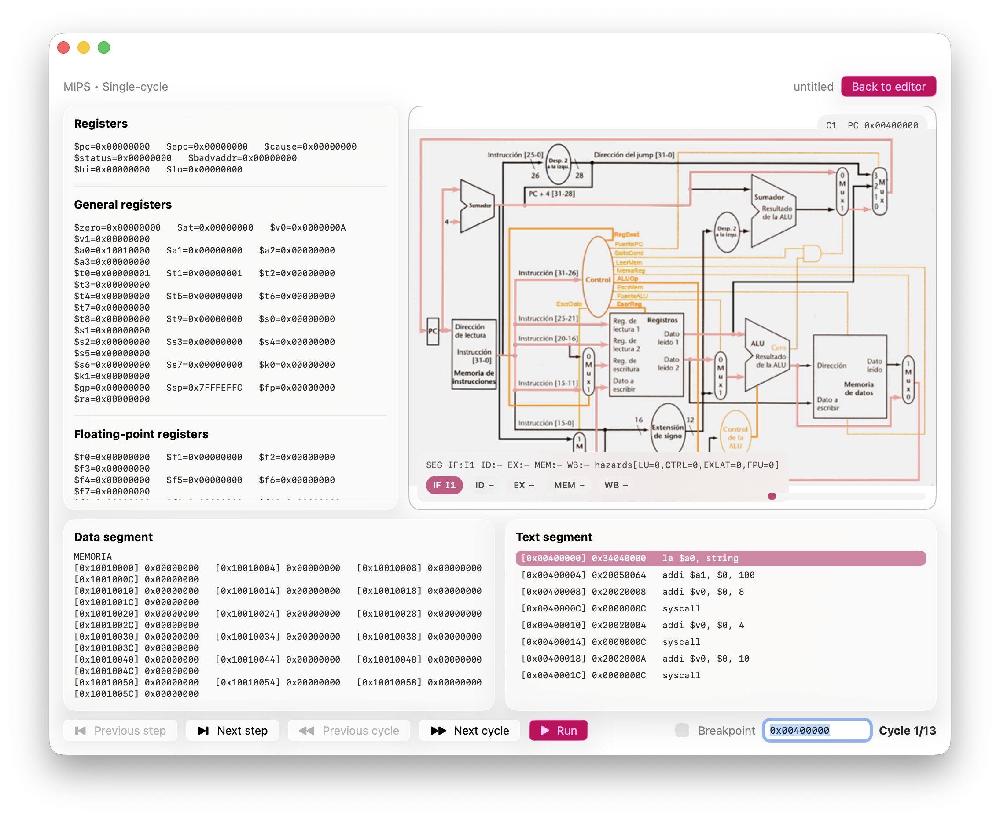
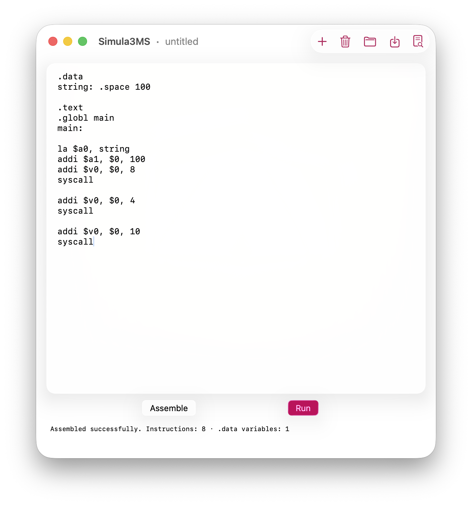
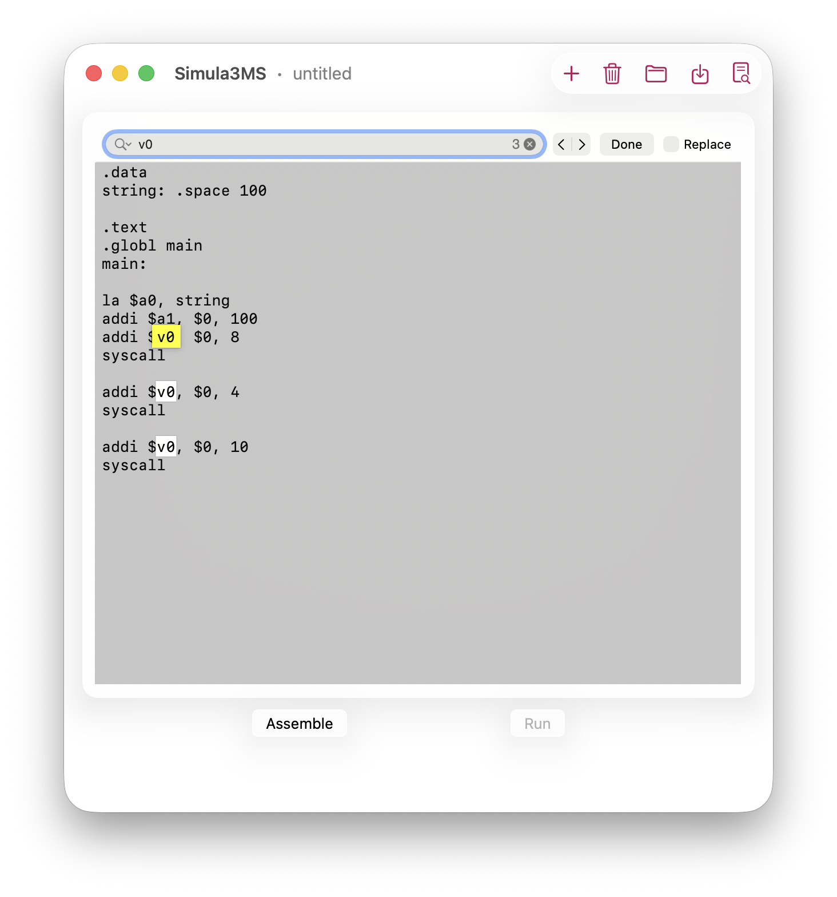

# Simula3MS-Swift

  
  
  

Native macOS version inspired by Simula3MS, an assembly-level computer architecture simulator developed at the University of A Coruña.

---

## Features

- Native and open-source macOS application written in **Swift/SwiftUI** from the ground up
- Runs significantly faster since it does not require the Java runtime used by the original application
- Integrated assembly editor and simulation environment
- Multiple processor simulation models:
  - Single-cycle
  - Multi-cycle
  - Basic pipelining
  - Scoreboard scheduling
  - Tomasulo dynamic scheduling
- Based on a subset of the **MIPS R2000/R3000 instruction set**
- Floating-point coprocessor support
- Input/output simulation via polling and interrupts
- Visual views for registers, memory, and execution state
- Localization support for **31 languages, including 14 with full Apple language API support**

  
  

---

## Acknowledgements

Inspired by the original **Simula3MS** project developed by the **Computer Architecture Group at the University of A Coruña**.

Original repository:  
https://github.com/sanxurxo/Simula3MS
